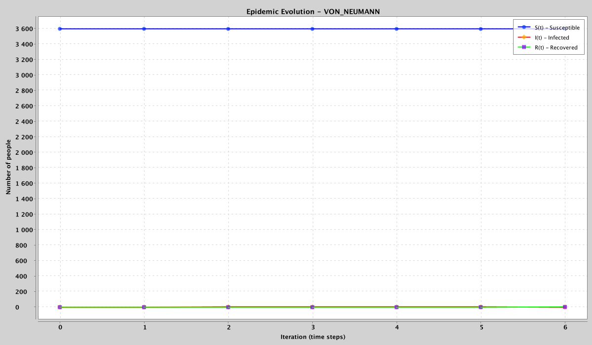
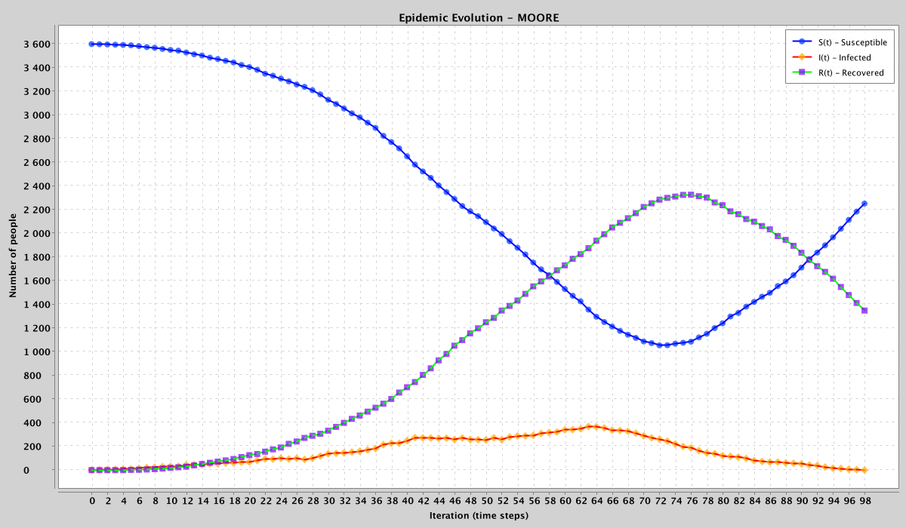
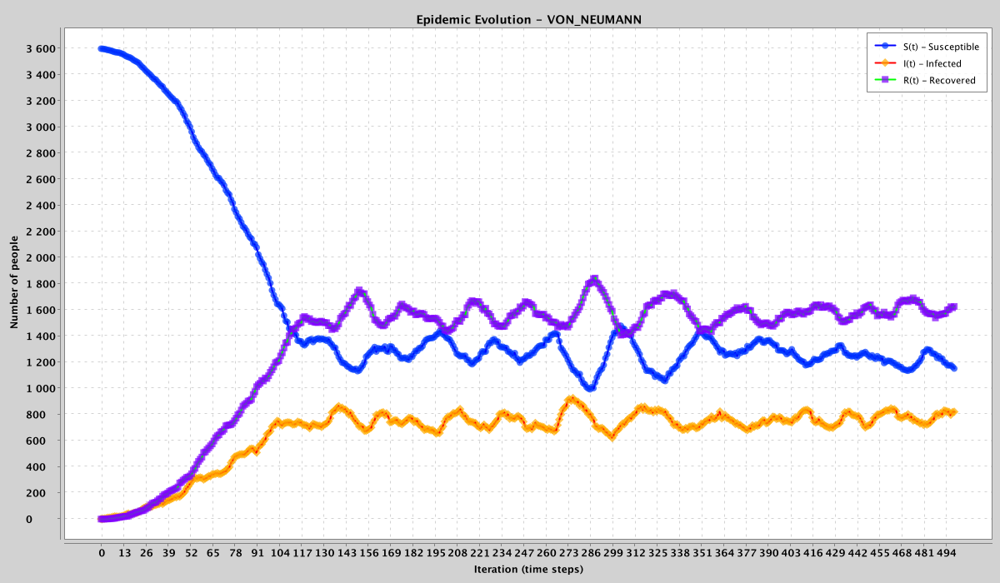
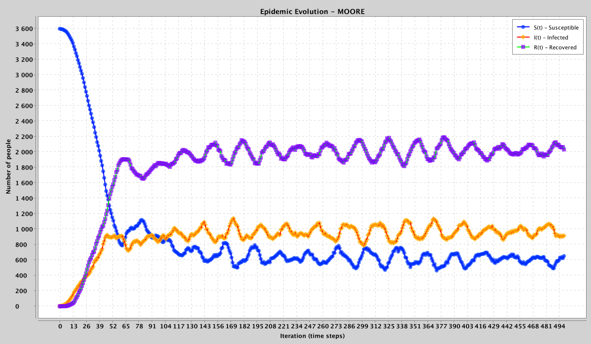
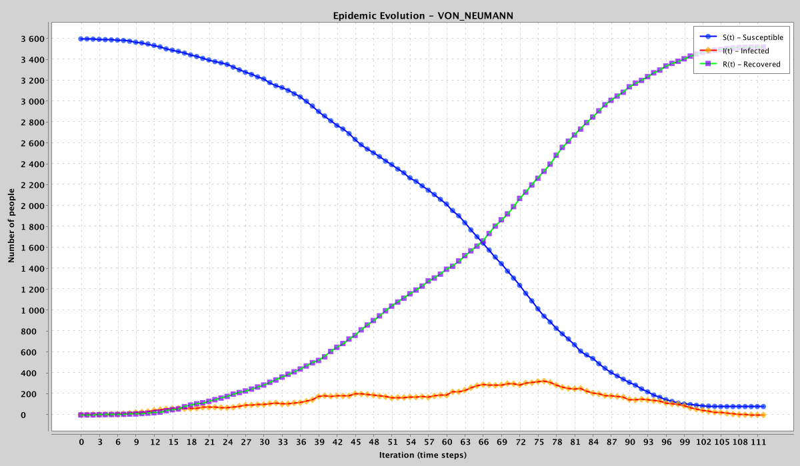
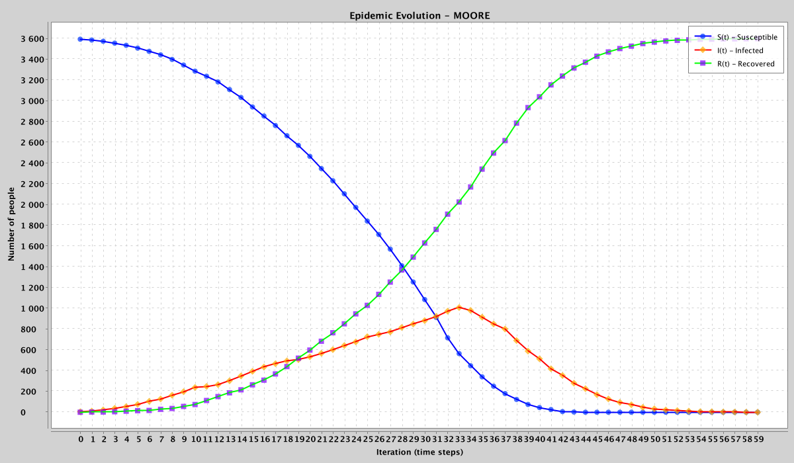

# Lab 4 - Epidemic Spreading

This project implements an epidemic spreading model on a 60×60 2D torus using a cellular automaton and GraphStream visualization. 
At each time step, infected agents may infect neighbors with probability `pi`, recover with probability `pr` (cumulative recovery probability \(1-(1-pr)^k\) after `k` steps), and recovered agents stay immune for `T` steps before becoming susceptible again (reinfection is possible).

## Features
- 2D torus grid (60×60) with two neighborhood types: **Von Neumann** (4 neighbors) and **Moore** (8 neighbors). 
- Live visualization (GraphStream): **blue** = Susceptible, **red** = Infected, **green** = Recovered. 
- CSV export + PNG plots of S(t), I(t), R(t) generated with XChart. 
- Automatic epidemic classification at the end of each run:
    - Type (i): infects all people and finally stops (S=0, I=0)
    - Type (ii): stops before infecting all (I=0, S>0)
    - Type (iii): never stops (endemic; I>0 at the end)

## How to run
Run the main class:
- `pl.uni.graphs.EpidemicSpreading` 

The program asks you to pick a preset (pi, pr, T) from the console, then runs **two simulations** with the same parameters:
1) Von Neumann neighborhood
2) Moore neighborhood 

Outputs (saved in the project directory):
- CSV: `epidemic_vonNeumann.csv`, `epidemic_moore.csv`
- PNG: `epidemic_vonNeumann.png`, `epidemic_moore.png`

## Results (plots in-table)

| Preset                   | Parameters (pi, pr, T) | Von Neumann (classification + plot)                                                                                                | Moore (classification + plot)                                                                                   |
|--------------------------|---:|------------------------------------------------------------------------------------------------------------------------------------|-----------------------------------------------------------------------------------------------------------------|
| 2 - ModerateEpidemic     | (0.12, 0.08, 35) | Type (ii) - stops with S>0.                                   | Type (ii) - stops with S>0.                    |
| 4 - EndemicEpidemic      | (0.18, 0.03, 15) | Type (iii) - endemic (I>0).                                    | Type (iii) - endemic (I>0).                    |
| 9 - FullOutbreakThenStop | (0.25, 0.08, 600) | Type (ii) - often stops with a small leftover S (stochastic).   | Type (i) - infects all and stops (S=0, I=0).   |

Notes:
- Moore often spreads faster/stronger than Von Neumann because each cell has more contacts per step. 
- Results are stochastic (random “patient zero” and random transmission/recovery events), so rerunning a preset may occasionally change the final classification. 
- The model records S/I/R counts each iteration, saves them to CSV, and generates the PNG charts via XChart. 
- UI / Window issue - the simulation opens multiple GUI windows, these windows may occasionally appear behind the IDE/console window, or a chart/viewer may look like it opened twice. This doesn't affect the simulation results: CSV and PNG outputs are still generated correctly.

